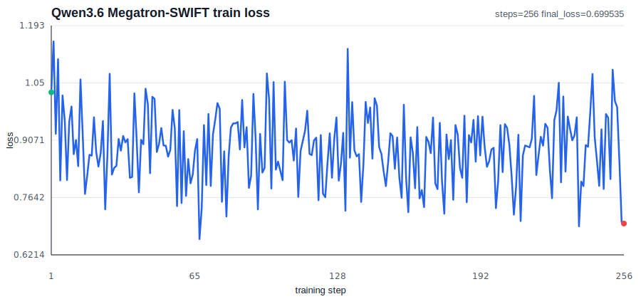
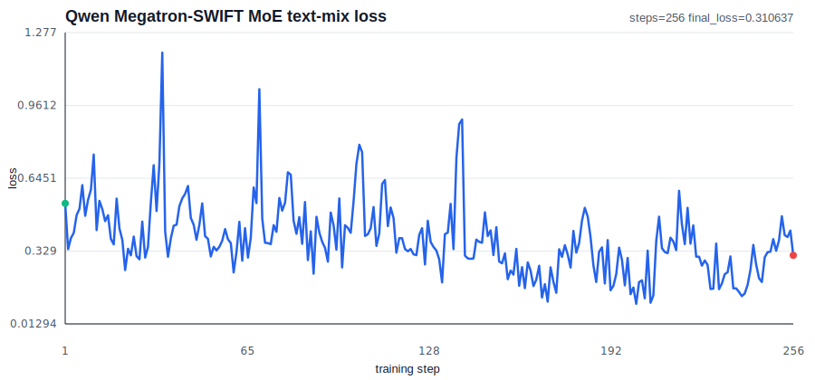

# LLM Fine-tuning Benchmark

## Purpose

Compare training time and cost across different GPU instances for various model sizes. The goal is to recommend optimal instance selection based on:

1. Training throughput (samples/sec)
2. Cost efficiency ($/1000 samples)
3. Scaling characteristics (single vs multi-GPU, single vs multi-node)

## Models

| Size | Model | HuggingFace ID |
|------|-------|----------------|
| 1B | TinyLlama | `TinyLlama/TinyLlama-1.1B-Chat-v1.0` |
| 7B | Mistral 7B | `mistralai/Mistral-7B-Instruct-v0.3` |
| 30B MoE | Qwen3 30B-A3B | `Qwen/Qwen3-30B-A3B` |
| 35B MoE | Qwen3.6 35B-A3B | `Qwen/Qwen3.6-35B-A3B` |
| 70B | Llama 3 | `meta-llama/Meta-Llama-3-70B` |

## Instance Comparison Dimensions

| Dimension | Options | Impact |
|-----------|---------|--------|
| **GPU Type** | A10G, L40S, RTX 6000, A100, H100 | VRAM, compute capability |
| **GPU Count** | 1, 2, 4, 8 | Parallelism overhead |
| **Node Count** | 1, 2, 4 | Inter-node communication overhead |
| **Intra-node Interconnect** | PCIe, NVLink, NVSwitch | Multi-GPU scaling efficiency |
| **Inter-node Interconnect** | Standard, EFA, GPUDirect RDMA | Multi-node scaling efficiency |
| **Parallelism** | DDP, FSDP, DeepSpeed ZeRO-3 | Memory vs communication tradeoff |

## Configuration Strategy

### Fixed Settings (Affect Model Quality)

These must be **identical across all runs** to ensure fair comparison:

```yaml
# LoRA configuration
lora_r: 16
lora_alpha: 32
lora_dropout: 0.05
lora_target_modules: ["q_proj", "v_proj", "k_proj", "o_proj"]

# Quantization / Sharding - per model size (see below)
# 1B, 8B: use_qlora: false (full precision LoRA)
# 70B: use_qlora: true (all instances, for fair comparison)
# 35B MoE: Megatron-SWIFT + LoRA + expert parallelism
# 235B: DeepSpeed ZeRO-3 + LoRA (full precision, sharded across 8 GPUs)

# Sequence length
max_seq_length: 2048

# Training
learning_rate: 2e-4
num_epochs: 1
max_samples: 10000
gradient_accumulation_steps: 1  # Fixed at 1 to maximize throughput

# Dataset
dataset: tatsu-lab/alpaca
dtype: bfloat16
```

### Variable Settings (Maximize Throughput)

Tune these **per instance** to maximize GPU utilization:

| Setting | Strategy | Notes |
|---------|----------|-------|
| **Batch size** | Maximize per GPU until OOM, then back off | Higher = better throughput |
| **Gradient checkpointing** | Enable only if it allows larger batch that nets more throughput | Trades compute for memory |
| **Flash Attention** | Always enable if supported | Free speedup, no quality impact |

### Why Different Batch Sizes Are OK

We're measuring **wall time to process 10000 samples**, not training convergence. Different batch sizes affect training dynamics, but since we fixed:
- LoRA rank and config (model capacity)
- Quantization (precision)
- Sequence length (context)

The comparison remains fair for benchmarking throughput.

### Cost Calculation

All cost figures use **on-demand pricing** (us-west-2, Linux, as of 2026-02-20 via AWS Pricing API). Spot prices fluctuate significantly and are unsuitable for reproducible cost comparisons. The formula:

```
$/10k samples = on_demand_price_per_hour × (wall_time_seconds / 3600)
```

Each run processes exactly 10,000 samples, so total job cost = cost per 10k samples.

## Instance Reference

| Instance | GPU | Count | VRAM/GPU | Interconnect | On-Demand $/hr | Notes |
|----------|-----|-------|----------|--------------|----------------|-------|
| g5.xlarge | A10G | 1 | 24GB | - | $1.006 | |
| g5.2xlarge | A10G | 1 | 24GB | - | $1.212 | |
| g5.4xlarge | A10G | 1 | 24GB | - | $1.624 | |
| g5.12xlarge | A10G | 4 | 24GB | PCIe (no P2P) | $5.672 | |
| g5.48xlarge | A10G | 8 | 24GB | PCIe (no P2P) | $16.288 | |
| g6e.xlarge | L40S | 1 | 48GB | - | $1.861 | |
| g6e.2xlarge | L40S | 1 | 48GB | - | $2.242 | |
| g6e.12xlarge | L40S | 4 | 48GB | PCIe (no P2P) | $10.493 | |
| g6e.48xlarge | L40S | 8 | 48GB | PCIe (no P2P) | $30.131 | |
| g7e.2xlarge | RTX 6000 Blackwell | 1 | 96GB | - | $3.363 | SDPA attention |
| g7e.12xlarge | RTX 6000 Blackwell | 2 | 96GB | PCIe + P2P | $8.286 | SDPA attention |
| g7e.24xlarge | RTX 6000 Blackwell | 4 | 96GB | PCIe + P2P | $16.572 | SDPA attention |
| g7e.48xlarge | RTX 6000 Blackwell | 8 | 96GB | PCIe + P2P | $33.144 | SDPA attention |
| p4d.24xlarge | A100 | 8 | 40GB | NVSwitch + EFA | $21.958 | |
| p5.48xlarge | H100 | 8 | 80GB | NVSwitch + EFA | $55.040 | |

## Benchmark Scenarios

### 1B Model (TinyLlama) - Validation

| ID | Instance | GPUs | Nodes | Parallelism | Status |
|----|----------|------|-------|-------------|--------|
| 1B-01 | g5.4xlarge | 1 | 1 | - | ✅ Completed |
| 1B-02 | g5.12xlarge | 4 | 1 | DDP | ✅ Completed |
| 1B-03 | g7e.2xlarge | 1 | 1 | - | ✅ Completed |
| 1B-04 | g7e.12xlarge | 2 | 1 | DDP (1 pod) | ✅ Completed |
| 1B-05 | g7e.12xlarge | 2 | 1 | DDP (2 pods) | ✅ Completed |
| 1B-06 | g5.4xlarge | 1 | 1 | - | ✅ Completed |
| 1B-07 | g5.12xlarge | 4 | 1 | DDP | ✅ Completed |
| 1B-08 | g7e.2xlarge | 1 | 1 | - | ✅ Completed |
| 1B-09 | g7e.12xlarge | 2 | 1 | DDP (1 pod) | ✅ Completed |
| 1B-10 | g6e.2xlarge | 1 | 1 | - | ✅ Completed |
| 1B-11 | g6e.12xlarge | 4 | 1 | DDP | ✅ Completed |
| 1B-12 | g7e.24xlarge | 4 | 1 | DDP | ✅ Completed |

### 7B Model (Mistral 7B) - Single GPU Baseline

| ID | Instance | GPUs | Nodes | Parallelism | Status |
|----|----------|------|-------|-------------|--------|
| 8B-01 | g5.2xlarge | 1 | 1 | QLoRA | ✅ Completed |
| 8B-02 | g6e.xlarge | 1 | 1 | - | ✅ Completed |
| 8B-03 | g7e.2xlarge | 1 | 1 | - | ✅ Completed |

### 7B Model - Multi-GPU Single Node

| ID | Instance | GPUs | Nodes | Parallelism | Status |
|----|----------|------|-------|-------------|--------|
| 8B-04 | g5.12xlarge | 4 | 1 | QLoRA+DDP | ✅ Completed |
| 8B-05 | g5.48xlarge | 8 | 1 | QLoRA+DDP | ✅ Completed |
| 8B-06 | g6e.12xlarge | 4 | 1 | DDP | ✅ Completed |
| 8B-07 | g6e.48xlarge | 8 | 1 | DDP | ✅ Completed |
| 8B-08 | g7e.24xlarge | 4 | 1 | DDP | ✅ Completed |
| 8B-09 | g7e.48xlarge | 8 | 1 | DDP | ✅ Completed |
| 8B-10 | p4d.24xlarge | 8 | 1 | DDP | ✅ Completed |
| 8B-11 | p5.48xlarge | 8 | 1 | DDP | ✅ Completed |

### 7B Model - Multi-Node

| ID | Instance | GPUs | Nodes | Parallelism | Status |
|----|----------|------|-------|-------------|--------|
| 8B-12 | g5.12xlarge | 8 | 2 | DDP | Pending |
| 8B-13 | g6e.12xlarge | 8 | 2 | DDP | Pending |
| 8B-14 | p4d.24xlarge | 16 | 2 | DDP | Pending |

### 70B Model - Single Node

| ID | Instance | GPUs | Nodes | Parallelism | Status |
|----|----------|------|-------|-------------|--------|
| 70B-02 | g6e.48xlarge | 8 | 1 | LoRA+FSDP | ⚠️ Estimated (job died) |
| 70B-03 | p4d.24xlarge | 8 | 1 | LoRA+FSDP | ✅ Completed |
| 70B-04 | p5.48xlarge | 8 | 1 | QLoRA+DDP | ✅ Completed |
| 70B-05 | g7e.48xlarge | 8 | 1 | QLoRA+DDP | ✅ Completed |
| 70B-12 | p5.48xlarge | 8 | 1 | LoRA+FSDP | ✅ Completed |
| 70B-13 | g7e.48xlarge | 8 | 1 | LoRA+FSDP | ✅ Completed |

### 70B Model - Multi-Node (QLoRA for all)

| ID | Instance | GPUs | Nodes | Parallelism | Status |
|----|----------|------|-------|-------------|--------|
| 70B-06 | g5.48xlarge | 16 | 2 | FSDP (HYBRID) | Pending |
| 70B-07 | g6e.48xlarge | 16 | 2 | FSDP (HYBRID) | Pending |
| 70B-08 | p4d.24xlarge | 16 | 2 | FSDP (HYBRID) | Pending |
| 70B-09 | p4d.24xlarge | 32 | 4 | FSDP (HYBRID) | Pending |

### 35B MoE Model (Qwen3.6-35B-A3B) - Expert Parallelism

| ID | Instance | GPUs | Nodes | Parallelism | Status |
|----|----------|------|-------|-------------|--------|
| 35B-MOE-01 | g6e.12xlarge | 4 | 1 | Megatron-SWIFT LoRA + EP=4 | ✅ Completed |
| 35B-MOE-02 | g6e.12xlarge | 4 | 1 | Megatron-SWIFT LoRA + EP=4 | ✅ Completed |
| 35B-MOE-03 | g6e.12xlarge | 4 | 1 | Megatron-SWIFT LoRA + EP=4 | ✅ Completed |
| 35B-MOE-04 | g6e.12xlarge | 4 | 1 | Megatron-SWIFT LoRA + EP=4 | ✅ Completed |
| 35B-MOE-05 | g6e.12xlarge | 4 | 1 | Megatron-SWIFT LoRA + EP=4 | ✅ Completed; checkpoint archived |

### 30B MoE Model (Qwen3-30B-A3B) - Expert Parallelism

| ID | Instance | GPUs | Nodes | Parallelism | Status |
|----|----------|------|-------|-------------|--------|
| 30B-MOE-01 | g6e.12xlarge | 4 | 1 | Megatron-SWIFT LoRA + EP=4 | ✅ Completed |
| 30B-MOE-02 | g6e.48xlarge | 8 | 1 | Megatron-SWIFT LoRA + EP=8 | Blocked: GPU vCPU quota |
| 30B-MOE-03 | g7e.12xlarge | 2 | 1 | Megatron-SWIFT LoRA + EP=2 | Blocked: insufficient capacity |
| 30B-MOE-04 | g5.12xlarge | 4 | 1 | Megatron-SWIFT LoRA + EP=4 | Failed: CUDA OOM |
| 30B-MOE-05 | g7e.8xlarge | 1 | 1 | Megatron-SWIFT LoRA + EP=1 | Blocked: insufficient capacity |
| 30B-MOE-06 | g7e.4xlarge | 1 | 1 | Megatron-SWIFT LoRA + EP=1 | Blocked: insufficient capacity |
| 30B-MOE-07 | g6e.2xlarge | 1 | 1 | Megatron-SWIFT LoRA + EP=1 | Failed: CUDA OOM |
| 30B-MOE-08 | p4d.24xlarge | 8 | 1 | Megatron-SWIFT LoRA + EP=8 | Blocked: node init failure |

## Results

### 1B Model

| ID | Batch/GPU | Throughput (samples/s) | Step (ms) | GPU % | VRAM (GB) | Wall Time | $/10k samples | Notes |
|----|-----------|------------------------|-----------|-------|-----------|-----------|---------------|-------|
| 1B-01 | 4 | 18.62 | 215 | - | - | 537s | $0.24 | g5.4xlarge, 1x A10G |
| 1B-02 | 4 | 55.59 | 288 | - | - | 180s | $0.28 | g5.12xlarge, 4-GPU DDP |
| 1B-03 | 4 | 44.81 | 89 | - | - | 223s | $0.21 | g7e.2xlarge, 1x RTX 6000 |
| 1B-04 | 4 | 82.30 | 97 | - | - | 122s | $0.28 | g7e.12xlarge, 1 pod/2 GPUs |
| 1B-05 | 4 | 77.13 | 104 | - | - | 130s | $0.30 | g7e.12xlarge, 2 pods/1 GPU each |
| 1B-06 | 6 | 20.22 | 294 | - | - | 495s | $0.22 | g5.4xlarge, 1x A10G, batch=6 (8 OOM) |
| 1B-07 | 6 | 57.65 | 416 | - | - | 173s | $0.27 | g5.12xlarge, 4-GPU DDP, batch=6 (8 OOM) |
| 1B-08 | 16 | 83.59 | 192 | - | - | 120s | $0.11 | g7e.2xlarge, 1x RTX 6000, batch=16 (32 OOM) |
| 1B-09 | 16 | 137.63 | 232 | - | - | 73s | $0.17 | g7e.12xlarge, 2-GPU DDP, batch=16 (32 OOM) |
| 1B-10 | 12 | 51.40 | 233 | - | - | 195s | $0.12 | g6e.2xlarge, 1x L40S, batch=12 |
| 1B-11 | 12 | 142.95 | 335 | - | - | 70s | $0.20 | g6e.12xlarge, 4-GPU DDP, batch=12 |
| 1B-12 | 16 | 232.58 | 274 | - | - | 43s | $0.20 | g7e.24xlarge, 4-GPU DDP, batch=16 |

### 7B Model - Single GPU

| ID | Batch/GPU | Throughput (samples/s) | Step (ms) | GPU % | VRAM (GB) | Wall Time | $/10k samples | Notes |
|----|-----------|------------------------|-----------|-------|-----------|-----------|---------------|-------|
| 8B-01 | 1 | 2.85 | - | - | - | 3504s | $1.18 | g5.2xlarge, 1x A10G, QLoRA |
| 8B-02 | 2 | 8.12 | 246 | - | - | 1231s | $0.64 | g6e.xlarge, 1x L40S |
| 8B-03 | 4 | 23.80 | 168 | - | - | 420s | $0.39 | g7e.2xlarge, 1x RTX 6000 |

### 7B Model - Multi-GPU Single Node

| ID | Batch/GPU | Throughput (samples/s) | Scaling Eff | GPU % | VRAM (GB) | Wall Time | $/10k samples | Notes |
|----|-----------|------------------------|-------------|-------|-----------|-----------|---------------|-------|
| 8B-04 | 1 | 9.63 | 1.19x | - | - | 1039s | $1.64 | g5.12xlarge, 4x A10G, QLoRA |
| 8B-05 | 1 | 15.05 | 1.86x | - | - | 664s | $3.00 | g5.48xlarge, 8x A10G, QLoRA |
| 8B-06 | 2 | 29.68 | 3.65x | - | - | 337s | $0.98 | g6e.12xlarge, 4x L40S |
| 8B-07 | 2 | 54.28 | 6.69x | - | - | 184s | $1.54 | g6e.48xlarge, 8x L40S |
| 8B-08 | 4 | 70.39 | 2.96x | - | - | 142s | $0.65 | g7e.24xlarge, 4x RTX 6000 |
| 8B-09 | 4 | 122.50 | 5.15x | - | - | 82s | $0.75 | g7e.48xlarge, 8x RTX 6000 |
| 8B-10 | 2 | 49.28 | 6.07x | - | - | 203s | $1.24 | p4d.24xlarge, 8x A100, NVSwitch |
| 8B-11 | 4 | 108.14 | - | 29-72% | 32.67 | 93s | $1.41 | p5.48xlarge, 8x H100, NVSwitch |
| 8B-15 | 6 | 145.99 | - | 44-84% | 39-44* | 69s | $1.05 | p5.48xlarge, 8x H100, batch=6 (12,8 OOM) |
| 8B-16 | 8 | 119.50 | - | - | - | 84s | $0.77 | g7e.48xlarge, 8x RTX 6000, batch=8 (10 OOM) |

### 7B Model - Multi-Node

| ID | Batch/GPU | Throughput (samples/s) | Scaling Eff | GPU % | VRAM (GB) | Wall Time | $/10k samples | Notes |
|----|-----------|------------------------|-------------|-------|-----------|-----------|---------------|-------|
| 8B-12 | - | - | - | - | - | - | - | g5.12xlarge x2 |
| 8B-13 | - | - | - | - | - | - | - | g6e.12xlarge x2 |
| 8B-14 | - | - | - | - | - | - | - | p4d.24xlarge x2 |

### 70B Model - Single Node

| ID | Batch/GPU | Throughput (samples/s) | Scaling Eff | GPU % | VRAM (GB) | Wall Time | $/10k samples | Notes |
|----|-----------|------------------------|-------------|-------|-----------|-----------|---------------|-------|
| 70B-02 | 1 | ~0.09† | - | 100% | 38.70 | ~111,250s† | ~$931† | g6e.48xlarge, 8x L40S, LoRA+FSDP, PCIe (no NVLink) |
| 70B-03 | 1 | 1.03 | - | 22-88% | 38.71 | 9667s | $59.0 | p4d.24xlarge, 8x A100, LoRA+FSDP, NVSwitch |
| 70B-04 | 1 | 5.17 | - | 23-71% | 50.80 | 1935s | $29.6 | p5.48xlarge, 8x H100, QLoRA+DDP, NVSwitch |
| 70B-05 | 1 | 7.51 | - | 89-97% | 36.82 | 1332s | $12.3 | g7e.48xlarge, 8x RTX 6000 Blackwell, QLoRA+DDP |
| 70B-10 | 4 | 17.07 | - | 97-100% | 53-57* | 586s | $8.96 | p5.48xlarge, 8x H100, QLoRA+DDP batch=4 |
| 70B-11 | 4 | 11.77 | - | - | 36.82+ | 850s | $7.83 | g7e.48xlarge, 8x RTX 6000, QLoRA+DDP batch=4 |
| 70B-12 | 1 | 1.33 | - | - | - | 7494s | $114.5 | p5.48xlarge, 8x H100, LoRA+FSDP, NVSwitch, 6.0s/step |
| 70B-13 | 1 | 0.67 | - | - | - | 14900s | $137.2 | g7e.48xlarge, 8x RTX 6000, LoRA+FSDP, PCIe (limited P2P), 11.9s/step |

†70B-02 estimated: job died at step 77/1250 (6%) after head pod recreation. Extrapolated from observed ~89s/step over 77 steps. FSDP on PCIe (g6e.48xlarge has no NVLink) is 11.5x slower than NVSwitch (70B-03 at 7.7s/step) due to all-reduce communication bottleneck. Not re-run — result demonstrates PCIe is impractical for FSDP on 70B models.

### 70B Model - Multi-Node

| ID | Batch/GPU | Throughput (samples/s) | Scaling Eff | GPU % | VRAM (GB) | Wall Time | $/10k samples | Notes |
|----|-----------|------------------------|-------------|-------|-----------|-----------|---------------|-------|
| 70B-06 | - | - | - | - | - | - | - | |
| 70B-07 | - | - | - | - | - | - | - | |
| 70B-08 | - | - | - | - | - | - | - | |
| 70B-09 | - | - | - | - | - | - | - | |

### 35B MoE Model (Qwen3.6-35B-A3B) - Megatron-SWIFT + LoRA + EP

| ID | Batch/GPU | Global Batch | Throughput (samples/s) | Scaling Eff | GPU % | VRAM (GB) | Wall Time | $/10k samples | Notes |
|----|-----------|--------------|------------------------|-------------|-------|-----------|-----------|---------------|-------|
| 35B-MOE-01 | 4 | 16 | 1.74† | - | - | 24.27 | 2m27s train / 736s attempt | ~$16.77† | g6e.12xlarge, 4x L40S, EP=4, LoRA r=8, unfused attention, 16 steps |
| 35B-MOE-02 | 8 | 32 | 1.97† | - | - | 24.77 | 2m10s train / 271s attempt | ~$14.79† | g6e.12xlarge, 4x L40S, EP=4, LoRA r=8, unfused attention, 8 steps |
| 35B-MOE-03 | 4 | 16 | 3.62 | - | 100% sampled | 27.14 logged / 29.6 observed | 18m52s train / 2223s full | ~$8.06 train-only / ~$15.82 full | g6e.12xlarge, 4x L40S, EP=4, LoRA r=8, unfused attention, 256 steps, `hf::vicgalle/alpaca-gpt4#4096` |
| 35B-MOE-04 | 4 | 16 | 2.14 | - | 99-100% sampled | 37.32 logged / 38.5-40.6 observed | 31m52s train / 3421s full | ~$13.61 train-only / ~$24.34 full | g6e.12xlarge, 4x L40S, EP=4, LoRA r=8, group_by_length, unfused attention, 256 steps, text-only multi-domain mix |
| 35B-MOE-05 | 4 | 16 | 2.14 | - | - | 38.10 logged | 31m52s train / 3459s full | ~$13.61 train-only / ~$24.61 full | Clean rerun of 35B-MOE-04; checkpoint-256 and merged 65.4 GiB archive preserved in external S3 |

†Historical smoke benchmark from the earlier local generated dataset on the clean us-east-2 validation cluster. 35B-MOE-04 is the current checked-in overlay result on the SWIFT-supported text-only multi-domain mix. 35B-MOE-05 reruns the same checked-in overlay and preserves both checkpoints outside the Terraform validation stack. 35B-MOE-03 remains the prior Alpaca-GPT4 baseline. Throughput and cost use the final cumulative Megatron `train_speed(s/it)` plus the document's g6e.12xlarge reference price. The "full" cost includes checkpoint merge and before/after sample inference, but still excludes one-time Qwen3.6 model cache population.

### 30B MoE Model (Qwen3-30B-A3B) - Megatron-SWIFT + LoRA + EP

| ID | Batch/GPU | Global Batch | Avg Tokens/Sample | Throughput | Token Throughput | GPU % | VRAM (GB) | Wall Time | $/10k samples | Notes |
|----|-----------|--------------|-------------------|------------|------------------|-------|-----------|-----------|---------------|-------|
| 30B-MOE-01 | 1 | 16 | 7268.5 | 0.213 s/s† | 1552 tok/s† | 98-100% | 30.42 logged / 36.0 observed | 39m58s train / 3127s attempt | ~$136.54† | g6e.12xlarge, 4x L40S, EP=4, LoRA r=8, flash attention, packed 8k, 32 steps |
| 30B-MOE-02 | 1 | 16 | - | - | - | - | - | - | - | g6e.48xlarge, 8x L40S, EP=8; blocked by `VcpuLimitExceeded` with GPU vCPU quota 64 |
| 30B-MOE-03 | 1 | 16 | - | - | - | - | - | - | - | g7e.12xlarge, 2x RTX 6000, EP=2; blocked by EC2 `InsufficientInstanceCapacity` in us-east-2 |
| 30B-MOE-04 | 1 | 16 | 7268.5 | - | - | - | 22.23 / 22.30 used | Failed at first forward | - | g5.12xlarge, 4x A10G, EP=4; CUDA OOM allocating 314 MiB |
| 30B-MOE-05 | 1 | 16 | - | - | - | - | - | - | - | g7e.8xlarge, 1x RTX 6000, EP=1; blocked by EC2 `InsufficientInstanceCapacity` in us-east-2 |
| 30B-MOE-06 | 1 | 16 | - | - | - | - | - | - | - | g7e.4xlarge, 1x RTX 6000, EP=1; blocked by EC2 `InsufficientInstanceCapacity` in us-east-2 |
| 30B-MOE-07 | 1 | 16 | 7268.5 | - | - | - | 44.38 / 44.39 used | Failed during model build | - | g6e.2xlarge, 1x L40S, EP=1; CUDA OOM instantiating Megatron MoE layers |
| 30B-MOE-08 | 1 | 16 | - | - | - | - | - | - | - | p4d.24xlarge, 8x A100, EP=8; node launched but Cilium failed before GPU registration |

†Historical benchmark from the earlier local generated packed dataset on the clean us-east-2 validation cluster. The overlay now uses the SWIFT-supported text-only multi-domain mix by default, so rerun this row before using it for dataset-sensitive throughput or quality comparisons. Throughput and cost use the final cumulative Megatron `train_speed(s/it)` of 74.950454s plus the document's g6e.12xlarge reference price, and exclude job startup, model load, and checkpoint merge. Including the full 3127s attempt duration, throughput is ~0.164 samples/s and cost is ~$178.01/10k samples. Failed rows used the same packed 8k Megatron-SWIFT Job manifest shape unless they were blocked before scheduling.

### 235B Model (Qwen3 MoE) - DeepSpeed ZeRO-3 + LoRA

| ID | Batch/GPU | Throughput (samples/s) | Scaling Eff | GPU % | VRAM (GB) | Wall Time | $/10k samples | Notes |
|----|-----------|------------------------|-------------|-------|-----------|-----------|---------------|-------|
| 235B-01 | 1 | 0.068† | - | - | 54.74 | ~40.6h† | ~$2,234† | p5.48xlarge, 8x H100, ZeRO-3+LoRA+CPU offload, NVSwitch, 117s/step |
| 235B-02 | 1 | 0.086† | - | - | 54.74 | ~32.3h† | ~$1,070† | g7e.48xlarge, 8x RTX 6000, ZeRO-3+LoRA+CPU offload, SDPA, 93s/step |

†235B results extrapolated from partial runs (23 steps / 42 steps respectively, not full 1250 steps). Step times measured with tuned ZeRO-3 buffers (max_live_parameters=2e8, prefetch_bucket_size=2e7) reducing cache flushes from 31/8-10 per step to ~1 per step. CPU offload for optimizer states enabled on both. Throughput = 8 samples per step (batch=1 × 8 GPUs) / step time.

## Commands

```bash
# Configure and run a benchmark
./scripts/setup.sh configure <model> quick-test
./scripts/setup.sh train

# Monitor GPU utilization
kubectl exec -it <pod> -- nvidia-smi dmon -s u

# Get training logs
kubectl logs -f job/<job-name>

# Check VRAM usage
kubectl exec -it <pod> -- nvidia-smi --query-gpu=memory.used,memory.total --format=csv

# Find max batch size (binary search)
# Start high, reduce until no OOM
```

## Observations

### 1B Benchmark Results (2025-02-15, updated 2026-02-25)

**Key Findings (with batch optimization):**

| Metric | Best | Worst | Notes |
|--------|------|-------|-------|
| **Throughput** | g7e.24xlarge batch=16 (232.6 s/s) | g5.4xlarge batch=4 (18.6 s/s) | 12.5x range across configs |
| **Cost Efficiency** | g7e.2xlarge batch=16 ($0.11/10k) | g7e.12xlarge batch=4 ($0.30/10k) | Batch tuning halved cost |
| **Batch Impact** | RTX 6000 +86% (batch 4→16) | A10G DDP +4% (batch 4→6) | VRAM limits A10G gains |

**Observations:**
- **g7e.2xlarge batch=16** is the most cost-efficient option at $0.11/10k samples (48% cheaper than batch=4)
- **g7e.12xlarge batch=16** achieved highest throughput (137.6 samples/sec), 67% faster than batch=4
- **RTX 6000 Blackwell** single GPU is 4.5x faster than A10G single GPU (83.6 vs 18.6 samples/sec)
- **A10G VRAM is the bottleneck**: 22.3GB effective VRAM limits batch to 8 (single) or 6 (DDP). Batch optimization yields minimal gains (+4% for DDP)
- **Multi-node (2 pods)** shows 6% overhead vs single pod due to inter-pod communication
- **4-GPU A10G DDP** scaling is good (3x with batch=4) but VRAM-limited — can't increase batch enough to improve further
- Initial SIGBUS errors on some nodes suggest EFS memory-mapped file issues under concurrent load; resolved with retries

### 7B Model A10G Limitations (2025-02-18)

**Finding:** A10G (24GB) cannot reliably run Mistral 7B with full-precision LoRA.

| Scenario | Result | Notes |
|----------|--------|-------|
| Single GPU (8B-01) | OOM after ~65% | Memory fragmentation over long runs |
| Multi-GPU DDP (8B-04, 8B-05) | OOM immediately | DDP buffers add ~2-3GB overhead |

**Root Cause:** Mistral 7B bf16 (~14GB) + LoRA + optimizer states + activations fills 24GB. Over long training runs, PyTorch CUDA memory fragmentation eventually causes OOM.

**Solution:** Use QLoRA (4-bit quantization) on A10G. QLoRA reduces base model memory from ~14GB to ~4GB, leaving headroom for DDP and long training runs.

### SIGBUS Fix (2025-02-18)

**Problem:** Jobs repeatedly crashed with SIGBUS (bus error) when loading model weights from EFS.

**Root Cause:** Safetensors uses `mmap()` by default to memory-map model files. On EFS (network filesystem), network hiccups or throttling invalidate mapped memory pages, causing SIGBUS when accessed.

**Fix:** Set `SAFETENSORS_FAST_GPU=0` environment variable in worker containers. This disables mmap and uses traditional `read()` instead, copying the entire model file into RAM before use. Adds ~10-30s to initial load time but prevents crashes.

**Additional Change:** Added `karpenter.sh/capacity-type: on-demand` nodeSelector to ensure benchmarks run on stable on-demand instances rather than Spot (which can be reclaimed mid-training).

### Karpenter Instance Type Limitations (2025-02-19, updated 2026-02-20)

**Problem:** g6e.48xlarge (8x L40S) and g7e.48xlarge (8x RTX 6000 Blackwell) initially failed to provision via Karpenter.

**Original Diagnosis (incorrect):** Believed instance types were missing from Karpenter's instance database.

**Actual Root Causes (discovered 2026-02-20):**
1. **NodePool resource limits too low:** GPU NodePool had `cpu: 1000, memory: 2000Gi` — insufficient for 48xlarge instances (192 vCPUs, 768-2048 GiB each). Fixed by increasing to `cpu: 2000, memory: 8000Gi`.
2. **Pod CPU requests too low:** Overlays requested 100 CPU (limit 120), but Ray Train needs `cpus_per_worker × num_workers` = `22 × 8 = 176 CPUs`. Ray couldn't schedule all 8 workers within the pod's cgroup limit. Fixed by setting CPU request=176, limit=192.
3. **g6e.48xlarge capacity:** AWS reports `InsufficientInstanceCapacity` for g6e.48xlarge on-demand across all us-west-2 AZs. Karpenter v1.9.0 does recognize the instance — it creates the nodeclaim but the EC2 CreateFleet call fails.

**Resolution:**
- 8B-09 (g7e.48xlarge): ✅ Provisioned and completed successfully after fixing NodePool limits and pod CPU requests.
- 8B-07 (g6e.48xlarge): ✅ Completed (capacity became available 2026-02-22)

**Selector Approach:** Using `node.kubernetes.io/instance-type` directly (e.g., `g7e.48xlarge`) works with Karpenter v1.9.0.

### 70B Benchmark - First Results (2026-02-20)

**70B-05: g7e.48xlarge (8x RTX 6000 Blackwell, 96GB VRAM each)**

| Metric | Value |
|--------|-------|
| Throughput | 7.51 samples/sec |
| Train loss | 0.9507 |
| GPU utilization | 89-97% |
| Model GPU memory | 36.82 GB (4-bit QLoRA) |
| Wall time (training) | 1332s (~22 min) |
| Wall time (total job) | ~27 min (includes model loading) |
| Cost | $12.27 / 10k samples |

**Key Findings:**
- **QLoRA+DDP works for 70B**: Each of 8 GPUs loads a 4-bit quantized copy (~37 GB), well within 96 GB VRAM. 8-way data parallel across GPUs.
- **Gradient checkpointing is critical**: Without it, activations for 70B models consume ~56 GB per GPU, causing OOM during training even though model loading succeeds.
- **transformers 5.x breaks QLoRA for large models**: The new `_materialize_copy` function eagerly materializes ALL weight tensors to GPU in bf16 via ThreadPoolExecutor before quantization. For 70B models (140 GB in bf16), this exhausts GPU memory before quantization can compress to ~35 GB. Pinned to transformers<5.0.0.
- **96 GB VRAM headroom**: With model at 37 GB + activations (gradient checkpointed), training used ~60-70 GB per GPU, leaving comfortable headroom.

**Capacity Issues:**
- g6e.48xlarge (70B-02): InsufficientInstanceCapacity across all us-west-2 AZs
- g7e.48xlarge (70B-05): Provisioned successfully

### g7e Blackwell Support (2025-02-12)

The g7e instance family uses **NVIDIA RTX PRO 6000 Blackwell Server Edition** GPUs with CUDA compute capability **sm_120** and 96GB VRAM.

**Status:** ✅ Working with PyTorch nightly (cu128) and CUDA 12.8.1

**Attention Implementation:**
- Flash Attention 2 does not yet support sm_120 (Blackwell)
- Using PyTorch's built-in SDPA (Scaled Dot Product Attention) as fallback
- Training code auto-detects GPU architecture and selects optimal attention

**Performance Notes:**
- g7e.2xlarge achieved 43.11 samples/sec (2.4x faster than g5.4xlarge)
- 96GB VRAM enables larger batch sizes or models without quantization
- SDPA provides near-Flash Attention performance on Blackwell architecture

### A100 Capacity Block Results (2026-02-21)

**8B-10: p4d.24xlarge (8x A100, NVSwitch) - Mistral 7B LoRA+DDP**

| Metric | Value |
|--------|-------|
| Throughput | 49.28 samples/sec |
| Train loss | 0.8508 |
| Wall time (training) | 203s |
| Cost | $1.24 / 10k samples |

**Key Findings:**
- **A100 DDP is competitive**: 49.28 samples/sec with full LoRA (no quantization) on 8x A100 with NVSwitch interconnect
- **NVSwitch advantage**: Direct GPU-to-GPU bandwidth eliminates the PCIe bottleneck seen in g5/g6e multi-GPU configs
- **Flash Attention 2 supported**: sm_80 (A100) fully supports FA2, contributing to higher throughput

**70B-03: p4d.24xlarge (8x A100, NVSwitch) - Llama 3 70B LoRA+FSDP**

| Metric | Value |
|--------|-------|
| Throughput | 1.03 samples/sec |
| Train loss | 0.9473 |
| GPU utilization | 22-88% (avg ~60%) |
| VRAM per GPU | 38.71 GB (of 40 GB) |
| Wall time (training) | 9667s (~2h41m) |
| Cost | $5.90 / 1k samples |

**Key Findings:**
- **40GB VRAM is barely sufficient**: FSDP FULL_SHARD shards the 70B model to ~17.5 GB/GPU, but with LoRA adapter, optimizer states, activations, and FSDP communication buffers, peak usage reaches 38.7 GB — only 1.3 GB headroom
- **Activation checkpointing is mandatory**: Without it, activations exceed available VRAM. Enabling FSDP `activation_checkpointing` solved the OOM but adds ~30% compute overhead (recomputing activations during backward pass)
- **FSDP vs QLoRA+DDP tradeoff**: 70B-03 (FSDP, 1.03 s/s) vs 70B-05 (QLoRA+DDP, 7.51 s/s) — QLoRA+DDP is 7.3x faster because each GPU independently runs a 4-bit quantized copy (~37 GB on 96 GB GPUs) with no FSDP communication overhead
- **Model saving hung**: After training completed, FSDP model save triggered NCCL timeout — rank 0 was gathering sharded state while other ranks timed out. Training metrics were captured before the hang

### H100 Capacity Block Results (2026-02-22)

**8B-11: p5.48xlarge (8x H100, NVSwitch) - Mistral 7B LoRA+DDP**

| Metric | Value |
|--------|-------|
| Throughput | 108.14 samples/sec |
| Train loss | 0.8519 |
| GPU utilization | 29-72% (avg ~47%) |
| VRAM per GPU | 32.67 GB (of 80 GB) |
| Wall time (training) | 93s |
| Cost | $1.41 / 10k samples |

**70B-04: p5.48xlarge (8x H100, NVSwitch) - Llama 3 70B QLoRA+DDP**

| Metric | Value |
|--------|-------|
| Throughput | 5.17 samples/sec |
| Train loss | 0.9507 |
| GPU utilization | 23-71% (avg ~43%) |
| VRAM per GPU | 50.80 GB (of 80 GB) |
| Wall time (training) | 1935s (~32 min) |
| Cost | $29.57 / 10k samples |

**Key Findings:**

- **NVSwitch topology**: p5.48xlarge uses NVSwitch for all-to-all GPU communication, same as p4d.24xlarge (verified NV12 on A100). H100 NVSwitch provides up to 900 GB/s bidirectional bandwidth per GPU
- **H100 severely underutilized at small batch sizes**: GPU utilization averages 43-47% with batch_size=1-4. H100's high compute throughput (3958 TFLOPS FP8) means it finishes matmuls faster but spends proportionally more time on fixed overhead (data loading, DDP gradient sync, Python framework). Larger batch sizes are needed to saturate the SMs.
- **70B-04 slower than 70B-05 despite higher-spec hardware**: H100 (5.17 s/s) vs RTX 6000 Blackwell (7.51 s/s). At batch_size=1, the H100's compute advantage is wasted on overhead. The RTX 6000 Blackwell achieves 89-97% utilization at the same batch size, suggesting its compute throughput is better matched to the per-sample workload at this scale.
- **VRAM heavily underutilized**: 8B uses 32.67/80 GB (41%), 70B uses 50.80/80 GB (64%). Increasing batch sizes would improve both throughput and utilization.
- **Cost-inefficient at current batch sizes**: At $55.04/hr, H100 must deliver proportionally higher throughput to justify the price. 8B-11 at $1.41/10k is competitive, but 70B-04 at $29.57/10k is 2.4x more expensive than 70B-05 ($12.27/10k) while being 31% slower.

### 35B MoE Megatron-SWIFT EP Official Dataset Validation (2026-05-02)

**Configuration:** Clean `dev` deploy in us-east-2 (`cluster_name=pr12eks`) from PR-12 after upstream sync. Terraform completed a fresh apply with 114 resources added. The benchmark ran Qwen3.6-35B-A3B with Megatron-SWIFT LoRA (rank 8, alpha 32, all-linear target modules), expert parallelism 4, 4 GPUs on one g6e.12xlarge, max_length=2048, micro batch 4, global batch 16, and unfused attention. The dataset was `hf::vicgalle/alpaca-gpt4#4096`, the HF mirror of SWIFT's registered `AI-ModelScope/alpaca-gpt4-data-en` example dataset. The evaluation sample set was `hf::vicgalle/alpaca-gpt4#3`.

**Run result:** Kubernetes Job `qwen-ep-benchmark` completed successfully with run root `/data/qwen-ep-bench/20260502-070008-g6e12-ep4-swift413-unfused`.

| Metric | 35B-MOE-03 |
|--------|------------|
| Instance | g6e.12xlarge, 4x L40S |
| Train iterations | 256 |
| Final cumulative train speed | 4.423551 s/it |
| Train throughput | 3.62 samples/s |
| Full run throughput | 1.84 samples/s including save, merge, and sample inference |
| Final train step loss | 0.69953525 |
| Eval loss at step 256 | 0.82834214 |
| Peak logged VRAM | 27.14 GiB |
| Sampled nvidia-smi memory | 29.6 GiB used / 45.0 GiB total per GPU |
| Sampled GPU utilization | 100% on all 4 GPUs |
| Full run duration | 2223s |



**Artifacts committed with this run:**

- `docs/benchmarks/qwen3.6-35b-a3b-ep-20260502/loss.csv`
- `docs/benchmarks/qwen3.6-35b-a3b-ep-20260502/loss.svg`
- `docs/benchmarks/qwen3.6-35b-a3b-ep-20260502/sample-compare.md`
- `docs/benchmarks/qwen3.6-35b-a3b-ep-20260502/summary.txt`

**Validation notes:**

- The PR-12 EFS `for_each` fix plans and applies cleanly on a fresh VPC/EKS deploy; the previous unknown-key Terraform planning failure did not reproduce.
- This run no longer used generated local data. It trained and sampled from the SWIFT-registered Alpaca-GPT4 text instruction dataset via the HF mirror; the checked-in overlay was later moved to the text-mix benchmark in 35B-MOE-04.
- The Job path is still the right wrapper for this EP validation. Megatron-SWIFT launches Megatron/torch.distributed directly, while the existing RayJob overlays wrap Ray Train and Hugging Face Trainer.
- Before/after prompt samples were generated from the completed merged checkpoint and are recorded in `sample-compare.md`.

### 35B MoE Megatron-SWIFT EP Text-Mix Validation (2026-05-02)

**Configuration:** Clean `dev` deploy in us-east-2 (`cluster_name=pr12eks`) from PR-12. Terraform completed a fresh apply with 114 resources added, including the EFS mount targets. The benchmark ran Qwen3.6-35B-A3B with Megatron-SWIFT LoRA (rank 8, alpha 32, all-linear target modules), expert parallelism 4, 4 GPUs on one g6e.12xlarge, max_length=2048, micro batch 4, global batch 16, grouped length batching, and unfused attention.

**Dataset rationale:** The checked-in overlay now uses a SWIFT-supported, text-only multi-domain mix instead of a single synthetic or Alpaca-style dataset. This is more appropriate for a MoE/EP validation because it exercises routing across reasoning, math/code-style problem solving, and general instruction following while staying within text-only Qwen3.6-35B-A3B SFT support.

**Training datasets:**

- `hf::open-thoughts/OpenThoughts-114k#2048`
- `hf::bespokelabs/Bespoke-Stratos-17k#1024`
- `hf::TIGER-Lab/MATH-plus#1024`
- `hf::allenai/tulu-v2-sft-mixture#1024`

**Evaluation sample datasets:**

- `hf::open-thoughts/OpenThoughts-114k#2`
- `hf::TIGER-Lab/MATH-plus#1`

**Run result:** Kubernetes Job `qwen-ep-benchmark` completed successfully with run root `/data/qwen-ep-bench/20260502-115207-g6e12-ep4-swift413-textmix`.

| Metric | 35B-MOE-04 |
|--------|------------|
| Instance | g6e.12xlarge, 4x L40S |
| Parallelism | TP=1, PP=1, EP=4 |
| MoE shape | 256 experts, top-8 routing |
| Train iterations | 256 |
| Dataset after filtering | 2,255 train / 23 eval samples |
| Train token length | 595.91 +/- 580.28, min 26, max 2047 |
| Final cumulative train speed | 7.469366 s/it |
| Train throughput | 2.14 samples/s |
| Full run throughput | 1.20 samples/s including save, merge, and sample inference |
| Final train step loss | 0.30890104 |
| Eval loss at step 256 | 0.47294652 |
| Peak logged VRAM | 37.32 GiB |
| Sampled nvidia-smi memory | 38.5-40.6 GiB used / 45.0 GiB total per GPU |
| Sampled GPU utilization | 99-100% on most samples |
| Full run duration | 3421s |


**Artifacts committed with this run:**

- `docs/benchmarks/qwen3.6-35b-a3b-ep-textmix-20260502/datasets.txt`
- `docs/benchmarks/qwen3.6-35b-a3b-ep-textmix-20260502/eval-datasets.txt`
- `docs/benchmarks/qwen3.6-35b-a3b-ep-textmix-20260502/logging.jsonl`
- `docs/benchmarks/qwen3.6-35b-a3b-ep-textmix-20260502/loss.csv`
- `docs/benchmarks/qwen3.6-35b-a3b-ep-textmix-20260502/loss.svg`
- `docs/benchmarks/qwen3.6-35b-a3b-ep-textmix-20260502/sample-compare.md`
- `docs/benchmarks/qwen3.6-35b-a3b-ep-textmix-20260502/summary.txt`

**Validation notes:**

- The PR-12 EFS `for_each` fix was checked again in the same clean deploy; Terraform planned and applied with known EFS mount target keys and the previous fresh-deploy planning failure did not reproduce.
- Megatron-SWIFT confirmed `model_type='qwen3_5_moe'`, `expert_model_parallel_size=4`, 256 experts, and top-8 routing in the run log.
- The short validation loss curve is noisy because the mix intentionally combines heterogeneous reasoning and instruction data, but the run completed with visible loss movement and a merged checkpoint usable for before/after samples.
- During eval setup SWIFT attempted ModelScope-style probes for HF dataset names and logged "Repo ... does not exist" messages, then used the already downloaded HF dataset cache. This did not fail the run.

### 35B MoE Megatron-SWIFT EP Text-Mix Checkpoint-Preserved Rerun (2026-05-02)

**Configuration:** Same checked-in text-mix overlay as 35B-MOE-04 on a clean `dev` deploy in us-east-2 (`cluster_name=pr12eks`). The rerun used Qwen3.6-35B-A3B, Megatron-SWIFT LoRA rank 8, EP=4, 4x L40S on one g6e.12xlarge, max_length=2048, micro batch 4, global batch 16, grouped length batching, and unfused attention.

**Run result:** Kubernetes Job `qwen-ep-benchmark` completed successfully with run root `/data/qwen-ep-bench/20260502-134932-g6e12-ep4-swift413-textmix`.

| Metric | 35B-MOE-05 |
|--------|------------|
| Instance | g6e.12xlarge, 4x L40S |
| Parallelism | TP=1, PP=1, EP=4 |
| Train iterations | 256 |
| Dataset after filtering | 2,255 train / 23 eval samples |
| Train token length | 595.91 +/- 580.28, min 26, max 2047 |
| Final cumulative train speed | 7.468456 s/it |
| Train throughput | 2.14 samples/s |
| Full run throughput | 1.18 samples/s including save, merge, and sample inference |
| Final train step loss | 0.31063735 |
| Eval loss at step 256 | 0.47261980 |
| Peak logged VRAM | 38.10 GiB |
| Full run duration | 3459s |
| Persistent checkpoint archive | `s3://qwen-ep-checkpoints-833277791039-us-east-2/qwen3.6-35b-a3b-textmix/20260502-134932-g6e12-ep4-swift413-textmix/` |
| S3 archive verification | 38 objects, 65.4 GiB, bucket versioning enabled |



**Artifacts committed with this rerun:**

- `docs/benchmarks/qwen3.6-35b-a3b-ep-textmix-rerun-20260502/checkpoint-s3-uri.txt`
- `docs/benchmarks/qwen3.6-35b-a3b-ep-textmix-rerun-20260502/datasets.txt`
- `docs/benchmarks/qwen3.6-35b-a3b-ep-textmix-rerun-20260502/eval-datasets.txt`
- `docs/benchmarks/qwen3.6-35b-a3b-ep-textmix-rerun-20260502/base-generations.jsonl`
- `docs/benchmarks/qwen3.6-35b-a3b-ep-textmix-rerun-20260502/finetuned-generations.jsonl`
- `docs/benchmarks/qwen3.6-35b-a3b-ep-textmix-rerun-20260502/logging.jsonl`
- `docs/benchmarks/qwen3.6-35b-a3b-ep-textmix-rerun-20260502/loss.csv`
- `docs/benchmarks/qwen3.6-35b-a3b-ep-textmix-rerun-20260502/loss.svg`
- `docs/benchmarks/qwen3.6-35b-a3b-ep-textmix-rerun-20260502/sample-compare.json`
- `docs/benchmarks/qwen3.6-35b-a3b-ep-textmix-rerun-20260502/sample-compare.md`
- `docs/benchmarks/qwen3.6-35b-a3b-ep-textmix-rerun-20260502/summary.txt`

**Validation notes:**

- The rerun preserved `checkpoint-256/` and `checkpoint-256-merged/` to an S3 bucket outside the Terraform stack before any cleanup.
- The merged checkpoint is the large artifact: 66 GiB on EFS, uploaded as 16 safetensors shards plus tokenizer/config files.
- vLLM sample generation confirmed expert parallelism during before/after inference: `Expert parallelism is enabled`, EP rank 0/4 with 64 local experts out of 256 global experts.

**Long before/after sample rerun (2026-05-03):**

- Restored the preserved `checkpoint-256-merged/` from the external S3 archive onto a clean eval-only us-east-2 EKS stack (`cluster_name=pr12eval`) and reran direct vLLM generation with `max_new_tokens=1024`, `vllm_max_model_len=4096`, TP=4, and EP enabled.
- Both base and fine-tuned inference logs confirmed EP rank 0/4 with 64 local experts out of 256 global experts.
- Artifacts: `docs/benchmarks/qwen3.6-35b-a3b-ep-textmix-long-compare-20260503/sample-compare.md`, `sample-compare.json`, `base-generations.jsonl`, and `finetuned-generations.jsonl`.
- Result: this qualitative check does not prove quality improvement. The fine-tuned model became much more concise, but Prompt 1 regressed: it accepts any one reachable transceiver pair instead of requiring all three people to be connected. Prompt 2 and Prompt 3 are correct and shorter than the base responses.

### 35B MoE Megatron-SWIFT EP Smoke Test (2026-04-29)

**Configuration (historical, superseded):** Qwen3.6-35B-A3B with Megatron-SWIFT LoRA (rank 8, alpha 32, all-linear target modules), expert parallelism 4, 4 GPUs on one g6e.12xlarge in the clean us-east-2 validation cluster, max_length=2048, 256 locally generated chat samples. The checked-in overlay has since been switched to the text-only multi-domain mix validated in 35B-MOE-04.

**Results:**

| Metric | 35B-MOE-01 | 35B-MOE-02 |
|--------|------------|------------|
| Micro batch / global batch | 4 / 16 | 8 / 32 |
| Steps | 16 | 8 |
| Final train_speed | 9.206532 s/it | 16.224566 s/it |
| Throughput | 1.74 samples/s | 1.97 samples/s |
| Peak logged VRAM | 24.27 GiB | 24.77 GiB |
| Final loss | 0.00075075 | 0.07459499 |
| Attempt duration | 736s | 271s |

**Key findings:**

- **RayJob is not the right execution wrapper for this path.** The existing Ray overlays run Ray Train plus Hugging Face Trainer. Megatron-SWIFT launches Megatron/torch.distributed process groups directly, so the reproducible overlay uses a Kubernetes Job.
- **`attention_backend=flash` failed on the first forward pass.** The failure was `ValueError: No dot product attention backend is available for the provided inputs`. Re-running with `attention_backend=unfused` completed both smoke tests.
- **EP=4 fits comfortably on L40S for this short LoRA workload.** Peak logged memory stayed under 25 GiB/GPU on 48 GiB L40S cards, leaving headroom for longer runs or larger batch exploration.
- **The first run is dominated by model cache population.** Initial Qwen3.6 cache population downloaded 40 files and used about 67 GiB on EFS; subsequent runs reused the cache and reached training quickly.
- **Merged checkpoint saving is a material part of wall time.** The validated overlay saved both Megatron weights and a merged safetensors checkpoint, adding about 6 minutes after the 16 training steps.
- **Smoke runs should include visible learning artifacts.** The Qwen3.6 overlay runs 256 steps, writes `metrics/loss.csv` plus `metrics/loss.svg`, and runs three sample prompts against both the base and fine-tuned model with thinking disabled for easier comparison. The current dataset default is the text-only multi-domain mix recorded in `datasets.txt`; the evaluation sample dataset is recorded in `eval/eval-datasets.txt`.
- **Treat these as smoke results, not final benchmark numbers.** The short smoke run is still dominated by warmup, model cache, and checkpoint save overhead relative to useful training time.

### 30B MoE Megatron-SWIFT EP Benchmark (2026-04-29)

**Configuration (historical, superseded):** Qwen3-30B-A3B with Megatron-SWIFT LoRA (rank 8, alpha 32, all-linear target modules), expert parallelism 4, 4 GPUs on one g6e.12xlarge in the clean us-east-2 validation cluster, max_length=8192, packing enabled, flash attention, 512 locally generated packed chat samples. The run reused the Qwen3.6 Kubernetes Job overlay with the model and benchmark parameters changed in a temporary manifest; rerun on the text-mix dataset defaults before treating this as a dataset-sensitive benchmark.

**Results:**

| Metric | 30B-MOE-01 |
|--------|------------|
| Micro batch / global batch | 1 / 16 |
| Steps | 32 |
| Dataset token length | 7268.5 +/- 1551.1, min 4582, max 8190 |
| Final train_speed | 74.950454 s/it |
| Throughput | 0.213 samples/s |
| Token throughput | 1552 tok/s total, 388 tok/s/GPU |
| Peak logged VRAM | 30.42 GiB |
| Observed nvidia-smi VRAM | up to 36.0 GiB |
| Observed GPU utilization | 98-100% |
| Final loss | 0.00060331 |
| Attempt duration | 3127s |

**Public comparison:**

- **Qwen/MS-SWIFT reference:** The public Qwen MS-SWIFT guide publishes a Qwen3-30B-A3B Megatron-SWIFT run on 2 nodes x 8 A800 80GiB GPUs with TP=2, EP=8, global batch 16, packing, max_length=8192, and flash attention. It reports Megatron-LM at 9.6s/it and 16 x 60GiB, versus DeepSpeed-ZeRO3 at 91.2s/it and 16 x 80GiB. Source: https://qwen.readthedocs.io/en/latest/training/ms_swift.html#megatron-swift
- **This EKS run:** 74.950454s/it is 7.8x slower than the Qwen Megatron reference on a per-step basis, but it used only 4 L40S GPUs on a single PCIe node and LoRA instead of the reference full-parameter setup. Numerically it is faster per step than the published ZeRO3 value, but that comparison is not apples-to-apples because the hardware count and trainable parameter set differ.
- **NVIDIA Megatron-Core context:** NVIDIA's MoE EP benchmark shows Mixtral 8x7B at 402 TFLOP/s/GPU on 128 H100 GPUs with EP=8 and pipeline parallelism. That is useful directional evidence for EP at scale, but not directly comparable to this 4x L40S LoRA smoke benchmark. Source: https://developer.nvidia.com/blog/train-generative-ai-models-more-efficiently-with-new-nvidia-megatron-core-functionalities/

**Key findings:**

- **The same Kubernetes Job path can exercise Qwen3-30B-A3B.** No RayJob changes were required; the Megatron-SWIFT Job overlay worked after changing the model and benchmark parameters.
- **8k packed Qwen3-30B-A3B fits on g6e.12xlarge with EP=4.** Logged Megatron memory stayed at 30.42 GiB/GPU and sampled nvidia-smi memory peaked at 36.0 GiB on 48 GiB L40S cards.
- **The run is compute-bound once training starts.** Sampled GPU utilization was 98-100%, while the final cumulative step time converged from 93.6s/it at step 1 to 74.95s/it by step 32.
- **Checkpoint merge still matters.** Training completed in 39m58s, but the full attempt took 3127s because it included model load and saving both Megatron and merged safetensors checkpoints.

### 30B MoE Matrix Follow-up (2026-04-29)

The follow-up matrix used the same `Qwen/Qwen3-30B-A3B` Megatron-SWIFT LoRA benchmark settings as 30B-MOE-01: rank 8 LoRA, max_length=8192, packing enabled, flash attention, micro batch 1, global batch 16, and the earlier locally generated packed chat samples. Rerun this matrix with the text-mix dataset defaults before comparing dataset-sensitive throughput or quality.

| ID | Config | Outcome | Evidence |
|----|--------|---------|----------|
| 30B-MOE-02 | g6e.48xlarge, 8x L40S, EP=8 | Blocked before pod start | Karpenter CreateFleet failed with `VcpuLimitExceeded`; the account GPU vCPU quota was 64 and the instance needs 192 vCPUs. |
| 30B-MOE-03 | g7e.12xlarge, 2x RTX 6000, EP=2 | Blocked before pod start | EC2 returned `InsufficientInstanceCapacity` across the available us-east-2 subnets. |
| 30B-MOE-04 | g5.12xlarge, 4x A10G, EP=4 | Failed after launch | Training reached the first forward pass and hit CUDA OOM: 22.23 GiB used out of 22.30 GiB while allocating 314 MiB. |
| 30B-MOE-05 | g7e.8xlarge, 1x RTX 6000, EP=1 | Blocked before pod start | EC2 returned `InsufficientInstanceCapacity`; an initial attempt was also delayed by the 64 GPU vCPU quota until the previous g5 node terminated. |
| 30B-MOE-06 | g7e.4xlarge, 1x RTX 6000, EP=1 | Blocked before pod start | EC2 returned `InsufficientInstanceCapacity` across the available us-east-2 subnets. |
| 30B-MOE-07 | g6e.2xlarge, 1x L40S, EP=1 | Failed after launch | Model construction OOMed before training: 44.38 GiB used out of 44.39 GiB while instantiating Megatron MoE layers. |
| 30B-MOE-08 | p4d.24xlarge, 8x A100, EP=8 | Blocked after node launch | p4d nodes launched, but Cilium entered CrashLoopBackOff with BPF map allocation failures; nodes kept `node.cilium.io/agent-not-ready` and did not register `nvidia.com/gpu`. |

**Matrix findings:**

- **Only the 4x L40S path completed in the current clean us-east-2 cluster.** It is the only configuration in this matrix that both provisioned and had enough memory for packed 8k Qwen3-30B-A3B LoRA.
- **24 GiB A10G and single 48 GiB L40S are too small for this exact Megatron-SWIFT EP setup.** The A10G run reached forward pass and OOMed; the single L40S run OOMed during model construction.
- **Larger GPU shapes still need quota/capacity or add-on cleanup before performance comparison.** g6e.48xlarge needs a GPU vCPU quota increase, g7e capacity was unavailable in this us-east-2 run, and p4d needs the Cilium/BPF node-init issue resolved before A100 NVSwitch benchmarking.

### 235B DeepSpeed ZeRO-3 Observations (2026-03-06)

**Configuration:** Qwen3 235B-A22B (MoE, 128 experts, top-8 routing) with DeepSpeed ZeRO-3 + LoRA (rank 16, full precision). 8 GPUs per instance, batch_size=1, grad_accum=1, max_samples=10000.

**Three critical bugs fixed during model loading:**

1. **`torch.distributed` must be initialized before model loading.** DeepSpeed's `zero.Init()` calls `dist.get_world_size()` to determine how to partition parameters. Without it, each GPU loads the full model → OOM. The training code originally skipped `dist.init_process_group()` for the DeepSpeed path, relying on HuggingFace Trainer to do it later — too late.

2. **`low_cpu_mem_usage` must be False for DeepSpeed.** When `True`, HuggingFace's `from_pretrained()` uses `accelerate`'s dispatch, which bypasses DeepSpeed's `zero.Init()` sharding. Setting it to `False` forces `from_pretrained()` to construct parameters normally, allowing `zero.Init()` to intercept and partition them across GPUs.

3. **`bf16.enabled` must be boolean `True`, not the string `"auto"`.** The DeepSpeed ZeRO-3 config uses `"auto"` for most fields (resolved later by HuggingFace Trainer). However, `zero.Init()` reads `bf16.enabled` during model construction to determine parameter dtype. The string `"auto"` evaluates as `"auto" == True → False`, so `zero.Init()` creates parameters in fp32 instead of bf16. This doubles memory: 235B × 4 bytes / 8 GPUs = **117.5 GB/GPU** (exceeds both H100 80GB and RTX 6000 96GB). Fix: use a separate `ds_load_config` with `"bf16": {"enabled": True}` for `HfDeepSpeedConfig`, while keeping `"auto"` in the training config.

**Memory analysis (bf16, 8 GPUs):**

| Component | Per GPU | Notes |
|-----------|---------|-------|
| Model parameters (ZeRO-3 shard) | ~58.75 GB | 470 GB / 8 GPUs |
| LoRA adapter + gradients | ~1-2 GB | Rank 16, all-linear |
| Optimizer states (without offload) | ~10-15 GB | Adam: 2x param states per shard |
| Activations + overhead | ~5-10 GB | batch=1, seq_len=2048 |
| **Total (no offload)** | **~75-86 GB** | |
| **Total (CPU offload optimizer)** | **~60-70 GB** | Optimizer states on CPU RAM |

**Training OOM on H100 80GB (without CPU offload):**

After model loading succeeded, 235B-01 (H100 80GB) OOMed on the first forward pass: `torch.OutOfMemoryError` with 76.73 GiB allocated. The ~58.75 GB model shard + LoRA + optimizer states + activations exceeded 80 GB VRAM. Meanwhile, 235B-02 (RTX 6000 96GB) trained successfully — the extra 16 GB VRAM provided sufficient headroom.

However, 235B-02 showed heavy memory pressure: **9-14 CUDA cache flushes per training step**. Each flush forces PyTorch to defragment and reallocate GPU memory, adding 20-40% overhead per step. This indicates VRAM was nearly full even on 96GB.

**Decision: CPU offload for optimizer states on both instances.**

Enabling `"offload_optimizer": {"device": "cpu", "pin_memory": True}` moves Adam optimizer states (~10-15 GB) to CPU RAM, freeing GPU VRAM for model parameters and activations. This:
- Makes H100 80GB viable (estimated ~60-70 GB peak VRAM)
- Eliminates cache flushes on RTX 6000 96GB
- Adds PCIe transfer overhead for optimizer step (~1-3s per step estimated)

Both p5.48xlarge and g7e.48xlarge use PCIe Gen5 (~64 GB/s bidirectional) for CPU↔GPU transfers, so the offload overhead should be comparable between instances — enabling a fair comparison.

**Pre-offload 235B-02 partial results (for reference):**

Before restart with CPU offload, 235B-02 trained to epoch 0.37 (462/1250 steps):
- Loss: 0.98 (decreasing from ~1.45 initial)
- Step time: ~100s (with 9-14 cache flushes per step)
- Mean token accuracy: ~0.73

**Buffer tuning eliminated severe cache flushes:**

Reducing ZeRO-3 buffer sizes (`max_live_parameters` 1e9→2e8, `prefetch_bucket_size` 5e7→2e7, `max_reuse_distance` 1e9→2e8) dropped cache flushes from 31/step (H100) and 8-10/step (RTX 6000) to just ~1/step on both. Step times improved significantly vs the pre-tuning run.

**Results (partial runs, extrapolated):**

| Metric | 235B-01 (H100 80GB) | 235B-02 (RTX 6000 96GB) | Delta |
|--------|---------------------|-------------------------|-------|
| Steps measured | 23 | 42 | |
| Avg step time | 117.0s | 93.0s | RTX 6000 26% faster |
| Throughput | 0.068 samples/s | 0.086 samples/s | RTX 6000 26% higher |
| Projected wall time (10k) | ~40.6h | ~32.3h | |
| Projected cost (10k) | ~$2,234 | ~$1,070 | RTX 6000 52% cheaper |
| Model shard per GPU | 54.74 GB | 54.74 GB | Identical |
| Cache flushes/step | ~1 | ~1 | Both manageable |

**Key finding: RTX 6000 96GB is significantly better than H100 80GB for 235B MoE fine-tuning with ZeRO-3.** The 16 GB extra VRAM (96 vs 80 GB) provides crucial headroom for ZeRO-3 AllGather buffers, and the g7e.48xlarge is 40% cheaper per hour ($33.14 vs $55.04). Combined, this makes RTX 6000 the clear winner: 26% faster and 52% cheaper for the same workload.

### 1B Batch Size Optimization (2026-02-25)

**Goal:** Maximize throughput for 1B scenarios by increasing batch size (1B-01 through 1B-04 used batch=4).

**Results:**

| ID | vs Baseline | Batch | Throughput | Improvement | Cost | Notes |
|----|-------------|-------|------------|-------------|------|-------|
| 1B-08 vs 1B-03 | g7e.2xlarge | 4→16 | 44.81→83.59 s/s | **+86%** | $0.21→$0.11 | Best cost efficiency across all 1B |
| 1B-09 vs 1B-04 | g7e.12xlarge | 4→16 | 82.30→137.63 s/s | **+67%** | $0.28→$0.17 | Highest absolute throughput |
| 1B-06 vs 1B-01 | g5.4xlarge | 4→6 | 18.62→20.22 s/s | **+9%** | $0.24→$0.22 | A10G batch=8 OOM (fragmentation) |
| 1B-07 vs 1B-02 | g5.12xlarge | 4→6 | 55.59→57.65 s/s | **+4%** | $0.28→$0.27 | A10G VRAM-limited (batch=8 OOM with DDP) |
| 1B-10 (new) | g6e.2xlarge | 12 | 51.40 s/s | - | $0.12 | L40S single-GPU, 2nd cheapest overall |

**Key Findings:**
- **RTX 6000 Blackwell benefits enormously from larger batches**: 86% throughput gain on single GPU, 67% on 2-GPU DDP. The 96GB VRAM allows batch=16 comfortably.
- **A10G gains are minimal**: Only batch=6 fits in 22.3GB effective VRAM (batch=8 OOMs due to memory fragmentation). DDP overhead (~2-3GB) doesn't change the limit.
- **L40S delivers strong cost efficiency**: g6e.2xlarge at batch=12 costs $0.12/10k samples — comparable to g7e.2xlarge ($0.11) at 61% of the throughput, making it the 2nd cheapest 1B configuration.
- **OOM boundaries**: RTX 6000 OOMs at batch=32 (attention memory ~86.5GB at seq_len=2048). A10G DDP OOMs at batch=8.
- **Cost efficiency improved**: g7e.2xlarge at batch=16 costs $0.11/10k samples — the cheapest 1B configuration and ~48% cheaper than batch=4.

### Batch Size Optimization Analysis (2026-02-22)

Current benchmarks use conservative batch sizes that leave significant VRAM headroom on high-VRAM GPUs (H100 80GB, RTX 6000 96GB). Since we measure wall time for 10k samples (not convergence), larger batches directly improve throughput without affecting the benchmark's validity.

**Memory Model:**

For LoRA+DDP (8B scenarios), gradient checkpointing is **disabled** (`gradient_checkpointing = use_qlora and not use_fsdp` = False). All activations are stored in VRAM:

```
VRAM = model_bf16 + lora_optimizer + activations(batch_size) + overhead
     = ~14 GB    + ~1 GB          + ~3.8 GB × batch_size    + ~2.5 GB
```

The ~3.8 GB/sample is derived from 8B-11 observed data: (32.67 - 17.5) / 4 = 3.8 GB per sample at batch_size=4.

For QLoRA+DDP (70B scenarios), gradient checkpointing is **enabled** (`gradient_checkpointing = use_qlora and not use_fsdp` = True). Only layer inputs are stored; activations are recomputed during backward:

```
VRAM = model_4bit + lora_optimizer + gc_activations(batch_size) + overhead
     = ~35 GB     + ~1 GB          + ~3 GB × batch_size         + ~12-14 GB
```

The per-sample activation cost with gradient checkpointing is lower (~3 GB vs ~3.8 GB for full activations) because only 80 layer inputs (2048 × 8192 × 2 bytes = 32 MB each = 2.56 GB total) plus backward recomputation temporaries are stored. The large overhead (~12-14 GB) includes CUDA context, PyTorch allocator reserves, gradient buffers, and dequantization workspace.

**Optimal Batch Size Estimates (90% VRAM target):**

| Scenario | GPU (VRAM) | Current batch | VRAM used | VRAM target (90%) | Per-sample cost | Optimal batch | Est. VRAM |
|----------|-----------|---------------|-----------|-------------------|-----------------|---------------|-----------|
| 8B on H100 | 80 GB | 4 | 32.67 GB | 72 GB | ~3.8 GB | **12** | ~63 GB |
| 8B on RTX 6000 | 96 GB | 4 | ~33 GB* | 86 GB | ~3.8 GB | **16** | ~78 GB |
| 70B on H100 | 80 GB | 1 | 50.80 GB | 72 GB | ~3 GB | **8** | ~72 GB |
| 70B on RTX 6000 | 96 GB | 1 | 36.82 GB | 86 GB | ~3 GB | **16** | ~82 GB |

*8B on RTX 6000 VRAM estimated from similar architecture; not directly measured.

**Notes:**
- 90% VRAM target leaves 10% headroom for PyTorch allocator fragmentation and peak memory spikes during backward pass
- 70B RTX 6000 shows lower base VRAM (36.82 GB) than H100 (50.80 GB) for the same QLoRA model — likely due to SDPA (RTX 6000) vs Flash Attention 2 (H100) memory profiles and different CUDA context sizes
- Actual optimal batch sizes should be validated empirically; these are estimates that may need adjustment by ±1-2 steps

**Empirical Correction (2026-02-22):**

The linear memory model above significantly underestimates peak VRAM. For LoRA+DDP without gradient checkpointing, `nvidia-smi` snapshots show 45-52 GB at batch=8 on H100, but peak VRAM during the backward pass spikes to **79 GB** — causing OOM. This is because:

1. **Backward pass stores both activations AND gradients simultaneously**: Peak memory is ~2x the snapshot measurement
2. **Memory fragmentation increases with batch size**: Per-sample cost is not constant — it grows from ~3.8 GB (batch=4) to ~5.8 GB (batch=8-12) due to allocator fragmentation
3. **PyTorch pre-allocates in large blocks**: Reserved-but-unallocated memory (4-5 GB) cannot be used for other allocations

**Actual results on H100 (80 GB):**
- batch=4: ✅ Snapshot 32.67 GB, peak fits within 80 GB
- batch=6: ✅ Snapshot 39-44 GB, peak fits within 80 GB (145.99 s/s, 35% faster than batch=4)
- batch=8: ❌ Snapshot 45-52 GB, peak 79 GB → OOM
- batch=12: ❌ Snapshot 65-79 GB, peak 79 GB → OOM

**Corrected Optimal Batch Sizes:**

| Scenario | GPU (VRAM) | Validated batch | Throughput | Improvement vs baseline |
|----------|-----------|-----------------|------------|------------------------|
| 8B on H100 | 80 GB | **6** | 145.99 s/s | +35% vs batch=4 (108.14 s/s) |
| 8B on RTX 6000 | 96 GB | **8** | 119.50 s/s | -2% vs batch=4 (122.50 s/s) — already saturated |
| 70B on H100 | 80 GB | **4** | 17.07 s/s | +230% vs batch=1 (5.17 s/s) |
| 70B on RTX 6000 | 96 GB | **4** | 11.77 s/s | +57% vs batch=1 (7.51 s/s) |

---

## Changelog

| Date | Change |
|------|--------|
| 2025-02-06 | Initial benchmark plan created |
| 2025-02-06 | Restructured to focus on instance comparison with fixed quality settings |
| 2025-02-12 | Added Blackwell (sm_120) support via PyTorch nightly cu128 |
| 2025-02-12 | Completed 1B-03 benchmark on g7e.2xlarge (43.11 samples/sec) |
| 2025-02-12 | Completed 1B-04 benchmark on g7e.12xlarge 2-GPU DDP (73.72 samples/sec) |
| 2025-02-14 | Re-ran 1B-02 with Flash Attention 2 (53.43 samples/sec, was 48.99 with eager) |
| 2025-02-15 | Re-ran 1B-01 with Flash Attention 2 (18.72 samples/sec, was 18.07 with eager) |
| 2025-02-15 | Added 1B-05 benchmark: g7e.12xlarge 2 pods/1 GPU each (75.08 samples/sec) |
| 2025-02-15 | Increased max_samples from 1000 to 10000; reset 1B results |
| 2025-02-15 | Completed all 1B benchmarks in parallel (10k samples each) |
| 2025-02-18 | Completed 8B benchmarks: 8B-01 through 8B-06, 8B-08 |
| 2025-02-19 | 8B-07, 8B-09 blocked: g6e.48xlarge/g7e.48xlarge not in Karpenter instance DB (tested v1.8.1 and v1.9.0) |
| 2026-02-20 | Fixed NodePool limits (cpu: 2000, memory: 8000Gi) and pod CPU requests for 48xlarge instances |
| 2026-02-20 | Completed 8B-09: g7e.48xlarge 8x RTX 6000 Blackwell (122.5 samples/sec, 5.15x scaling) |
| 2026-02-20 | 8B-07 blocked: g6e.48xlarge on-demand capacity unavailable in us-west-2 (not a Karpenter DB issue) |
| 2026-02-20 | Switched cost calculations from spot to on-demand pricing (AWS Pricing API) for reproducibility |
| 2026-02-20 | Fixed transformers 5.x QLoRA OOM: pinned transformers<5.0.0 (5.x eagerly materializes weights to GPU in bf16 before quantization) |
| 2026-02-20 | Enabled gradient checkpointing for QLoRA (non-FSDP) to prevent training OOM on 70B models |
| 2026-02-20 | Completed 70B-05: g7e.48xlarge 8x RTX 6000 Blackwell QLoRA+DDP (7.51 samples/sec, $12.27/10k) |
| 2026-02-20 | 70B-01, 70B-02 blocked: g5.48xlarge and g6e.48xlarge on-demand capacity unavailable in us-west-2 |
| 2026-02-21 | Completed 8B-10: p4d.24xlarge 8x A100 LoRA+DDP (49.28 samples/sec, $1.24/10k) |
| 2026-02-21 | Fixed FSDP activation_checkpointing: was disabled, causing OOM on 40GB A100s for 70B models |
| 2026-02-21 | Completed 70B-03: p4d.24xlarge 8x A100 LoRA+FSDP (1.03 samples/sec, $5.90/1k) |
| 2026-02-22 | Completed 8B-07: g6e.48xlarge 8x L40S LoRA+DDP (54.28 samples/sec, $1.54/10k) |
| 2026-02-22 | Completed 8B-11: p5.48xlarge 8x H100 LoRA+DDP (108.14 samples/sec, $1.41/10k) |
| 2026-02-22 | Completed 70B-04: p5.48xlarge 8x H100 QLoRA+DDP (5.17 samples/sec, $29.57/10k) |
| 2026-02-22 | Fixed 70B-02: Changed from QLoRA+DDP to LoRA+FSDP (QLoRA loading OOMs on 48GB L40S) |
| 2026-02-22 | 8B-15 batch optimization: batch=12 OOM, batch=8 OOM, batch=6 ✅ (145.99 s/s, 35% faster) |
| 2026-02-22 | Updated batch size optimization analysis with empirical OOM data |
| 2026-02-22 | Completed 70B-10: p5.48xlarge 8x H100 QLoRA+DDP batch=4 (17.07 s/s, 3.3x faster, $8.96/10k) |
| 2026-02-23 | Completed 70B-11: g7e.48xlarge 8x RTX 6000 QLoRA+DDP batch=4 (11.77 s/s, 57% faster, $7.82/10k) |
| 2026-02-23 | 8B-16: batch=10 OOMed at step 119/125; batch=8 ✅ (119.50 s/s, no improvement — RTX 6000 already saturated at batch=4) |
| 2026-02-23 | 70B-02: recorded estimated results (~0.09 s/s, ~30.9h, ~$93.1/1k) — job died, not re-run (PCIe impractical for FSDP 70B) |
| 2026-02-25 | 1B batch size optimization: created 1B-06 through 1B-10 to maximize throughput via larger batch sizes |
| 2026-02-25 | 1B-06: g5.4xlarge batch=6 (20.22 s/s, +9% gain vs batch=4; batch=8 OOM from memory fragmentation) |
| 2026-02-25 | 1B-08: g7e.2xlarge batch=16 (83.59 s/s, 1.87x vs batch=4, $0.11/10k — best cost efficiency) |
| 2026-02-25 | 1B-09: g7e.12xlarge 2-GPU DDP batch=16 (137.63 s/s, 1.67x vs batch=4, highest 1B throughput) |
| 2026-02-25 | 1B-07: g5.12xlarge 4-GPU DDP batch=6 (57.65 s/s, ~4% gain vs batch=4; A10G DDP limited by 22.3GB VRAM) |
| 2026-02-25 | 1B-10: g6e.2xlarge failed to provision — Karpenter has no valid offering for g6e.2xlarge in us-west-2 |
| 2026-02-26 | 1B-10: g6e.2xlarge provisioned and completed (51.40 s/s, $0.12/10k — 2nd cheapest 1B config) |
| 2026-03-04 | Added 235B benchmark scenarios: Qwen3 235B MoE with DeepSpeed ZeRO-3 + LoRA on p5.48xlarge (235B-01) and g7e.48xlarge (235B-02) |
| 2026-03-06 | Fixed DeepSpeed ZeRO-3 model loading OOM: bf16 "auto" string not resolved by zero.Init(), causing fp32 allocation (2x memory) |
| 2026-03-06 | Fixed training OOM on H100 80GB: enabled CPU offload for optimizer states (model shard + LoRA + optimizer > 80GB without offload) |
| 2026-03-06 | Restarted both 235B-01 and 235B-02 with identical CPU offload config for fair comparison |
| 2026-03-06 | Tuned ZeRO-3 buffers (max_live_params 1e9→2e8, prefetch 5e7→2e7) — cache flushes dropped from 31/8-10 to ~1 per step |
| 2026-03-06 | 235B results: H100 117s/step (0.068 s/s, ~$2,234/10k), RTX 6000 93s/step (0.086 s/s, ~$1,070/10k). Extrapolated from partial runs |
| 2026-03-07 | Added 70B-12 (p5.48xlarge LoRA+FSDP) and 70B-13 (g7e.48xlarge LoRA+FSDP) to test NVSwitch vs PCIe for FSDP |
| 2026-03-07 | Completed 70B-12: p5.48xlarge 8x H100 LoRA+FSDP (1.33 s/s, 6.0s/step, 7494s, $114.5/10k). Crashed during model save (OOM on FSDP state dict gather) |
| 2026-03-08 | Completed 1B-11: g6e.12xlarge 4x L40S DDP batch=12 (142.95 s/s, 70s, $0.20/10k) — highest 1B throughput overall |
| 2026-03-15 | Completed 1B-12: g7e.24xlarge 4x RTX 6000 Blackwell DDP batch=16 (232.58 s/s, 43s, $0.20/10k — highest 1B throughput) |
| 2026-03-10 | Completed 70B-13: g7e.48xlarge 8x RTX 6000 LoRA+FSDP (0.67 s/s, 14900s, $137.2/10k). PCIe with limited P2P, 11.9s/step — significantly slower than NVSwitch (70B-12 at 6.0s/step) |
| 2026-05-02 | Reran Qwen3.6-35B-A3B text-mix EP=4 on a clean us-east-2 deploy and archived checkpoint-256 plus the 65.4 GiB merged checkpoint to external S3 before cleanup |
| 2026-05-03 | Restored the preserved Qwen3.6-35B-A3B merged checkpoint on a clean eval stack and reran 1024-token before/after samples; documented one coding-sample regression plus two shorter correct responses |
| 2026-05-02 | Revalidated Qwen3.6-35B-A3B Megatron-SWIFT EP=4 on a clean us-east-2 deploy with the SWIFT-supported text-only multi-domain mix: 256 steps completed at 7.469366s/it, 2.14 s/s train throughput, 37.32 GiB logged VRAM, eval loss 0.47294652, and before/after sample artifacts committed |
| 2026-05-02 | Revalidated Qwen3.6-35B-A3B Megatron-SWIFT EP=4 on a clean us-east-2 deploy with the SWIFT-registered Alpaca-GPT4 example dataset: 256 steps completed at 4.423551s/it, 3.62 s/s train throughput, 27.14 GiB logged VRAM, and before/after sample artifacts committed |
| 2026-05-01 | Revalidated Qwen3.6-35B-A3B Megatron-SWIFT EP=4 after upstream main sync and clean us-east-2 deploy: mb4/global16 completed with 9.206532s/it, 1.74 s/s, 24.27 GiB logged VRAM |
| 2026-04-29 | Completed Qwen3.6-35B-A3B Megatron-SWIFT EP=4 smoke benchmark on g6e.12xlarge: mb4/global16 at 1.70 s/s and mb8/global32 at 1.97 s/s; flash attention failed, unfused attention completed |
| 2026-04-29 | Completed Qwen3-30B-A3B Megatron-SWIFT EP=4 8k packed benchmark on g6e.12xlarge: mb1/global16 at 74.950454s/it, 0.213 s/s, 1552 tok/s, 30.42 GiB logged VRAM |
| 2026-04-29 | Ran Qwen3-30B-A3B matrix follow-up: g5.12xlarge and g6e.2xlarge OOMed, g6e.48xlarge blocked on GPU vCPU quota, g7e shapes blocked on regional capacity, and p4d blocked on Cilium/GPU node initialization |
